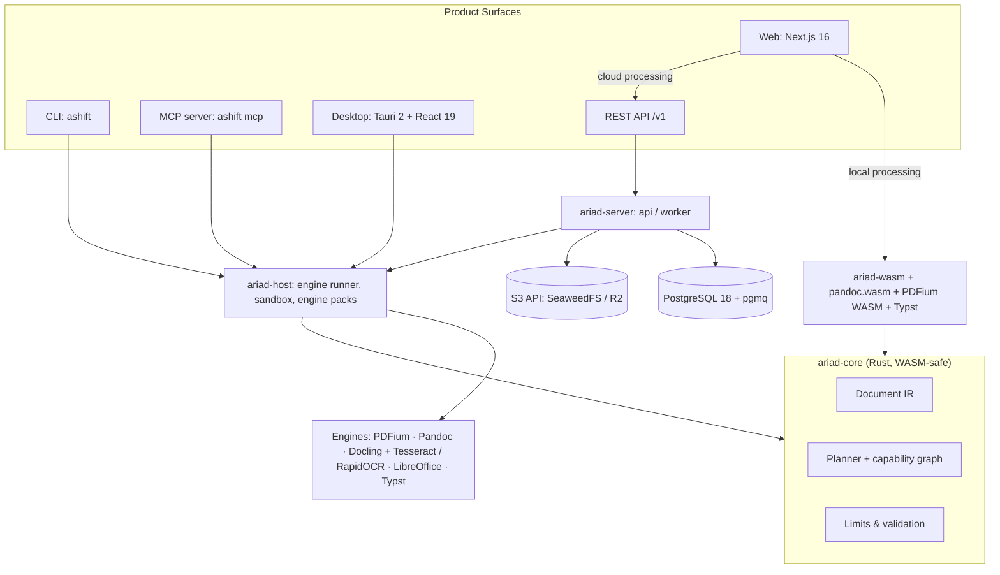
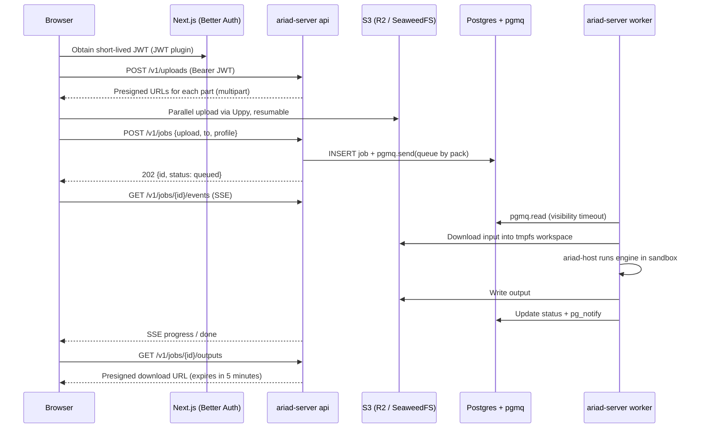

# AriadShift — System Architecture

> **Status:** Proposal v1 · **Updated:** 2026-10-06
> Version selections are based on registry and release checks recorded on 2026-10-06; lockfiles pin exact resolved versions.

AriadShift is an open-source, local-first document transformation platform. A single core engine powers five surfaces: **CLI, Desktop, Web, REST API/SDK, and MCP server**.

The name is derived from Ariadne's thread: AriadShift's planner navigates the format "labyrinth," just as Ariadne's thread guided Theseus out of the maze.

**Three product differentiators:**

1. **Private by default.** Browser and desktop process first; cloud is an option, not the default.
2. **Measurable quality.** Every conversion route has a score generated from public benchmarks, never hand-coded.
3. **AI agent ready.** Any document → clean Markdown/JSON via MCP, immediately usable as LLM context.

---

## 1. Architectural Principles

| # | Principle | Concrete Implications |
|---|---|---|
| 1 | One core, multiple surfaces | CLI, Desktop, Web, API, and MCP invoke the same `ariad-core`; no surface contains dedicated conversion logic |
| 2 | IR-centric (hub-and-spoke) | N readers + M writers instead of N×M converters; adding a format requires only a single adapter |
| 3 | Out-of-process engines, uniform protocol | All untrusted file parsing runs in sandboxed child processes; an engine crash never crashes the host app |
| 4 | Local-first | Priority order: browser → desktop/CLI → cloud |
| 5 | Evidence over claims | Fidelity and speed scores for each route are generated from `bench/`, where the planner reads them |
| 6 | Secure by default | Resource limits, decompression bomb prevention, no network access for engines, no content logging |
| 7 | First-class self-hosting | `docker compose up` runs the complete stack with zero external cloud accounts required |
| 8 | License clean | Apache-2.0 project; no AGPL in distribution; CI blocks invalid licenses |
| 9 | No lock-in | Open standards at every boundary: S3 API, OpenAPI 3.1, JWT/JWKS, OpenTelemetry, MCP |

Native Markdown parsing now, and native HTML parsing later, in `ariad-core` run in-process as explicit exceptions to Principle 3. These readers are pure Rust with `#![forbid(unsafe_code)]`, typed errors, and finite nesting and block limits; core readers are fuzzed starting in roadmap 1a. Every other parser runs out of process.

---

## 2. Versioning Policy

- Components **with an LTS channel** → use the **latest LTS**.
- Components **without LTS** → use the **latest stable release**.
- **Do not use** alpha, beta, or RC builds, even when available (e.g., Tauri 3 alpha, PostgreSQL 19 beta).
- Pin exact versions via lockfiles (`pnpm-lock.yaml`, `Cargo.lock`, `uv.lock`). Renovate opens weekly update PRs; patch releases automerge when CI passes.

### 2.1 Runtimes and Platforms

| Component | Pinned Version | Channel | Notes |
|---|---|---|---|
| Node.js | **24.x "Krypton"** (24.21) | LTS | Node 26 enters LTS on **2026-10-28** → upgrade immediately after that date. Node 24 is maintained until 2028-04-30 |
| Rust | **1.99** stable, edition 2024 | Stable (Rust has no LTS) | Pinned via `rust-toolchain.toml` |
| Python | **3.14.x** | Stable, supported until 2030-10 | Python has no LTS; 3.15 is unreleased |
| PostgreSQL | **18.x** (18.6) | Major supported until 2030-11 | 19 is in beta |
| Ubuntu (Docker image, CI) | **26.04 LTS** "Resolute Raccoon" | LTS | Single base image for all containers |
| GitHub Actions runners | `ubuntu-26.04`, `macos-26`, `windows-2025` | GA | Pin labels explicitly; `ubuntu-latest` remains 24.04 until November 2026 |
| LibreOffice | **26.8.x** | Longest-supported line currently available (until 2027-06) | LibreOffice has no LTS; 26.2 expires 2026-11-30 |

### 2.2 Web and Desktop

| Component | Version | Notes |
|---|---|---|
| Next.js | **16.3.x** | Current LTS line; Next 15 reaches end of support on 2026-10-21 |
| React | 19.3 | |
| TypeScript | **7.0** (native Go compiler) | 8–12x faster. Next 16.3 uses it via `experimental.useTypeScriptCli`; JS API available from 7.1 |
| Vite | 8.3 (Rolldown bundler) | Used for desktop |
| Tailwind CSS | 4.3 | |
| shadcn/ui | CLI 4.x, **Base UI** style (`@base-ui/react` 1.8) | Base UI has been the shadcn default since 07/2026 |
| Tauri | **2.12** | Tauri 3 is in alpha → not yet adopted |
| TanStack Query / Zustand / Zod | 5 / 5 / 4 | Server state / UI state / schema |
| React Hook Form / Motion / lucide-react | 7 / 14 / 1.x | |
| Uppy | 6 (+ `@uppy/aws-s3`) | Resumable multipart uploads |
| Better Auth | 1.7 | Includes JWT, API Key, and Passkey plugins |
| pnpm | 12 | Workspace + catalog |
| Biome | 2.5 | Single-binary linter + formatter; independent of TypeScript JS APIs |
| Vitest / Playwright | 5 / 1.63 | |

### 2.3 Rust Crates

| Crate | Version | Role |
|---|---|---|
| tokio | **~1.53** | **LTS line until 2027-09** (pinned to minor with `~`) |
| axum / tower / tower-http | 0.8 / 0.5 / 0.7 | HTTP API |
| sqlx | 0.9 | Postgres, compile-time checked SQL |
| object_store | 0.14 | Unified API for S3, R2, GCS, Azure, and local disk |
| utoipa | 6 | OpenAPI 3.1 generation from code |
| tracing / opentelemetry | 0.1 / 0.33 | Observability |
| serde / thiserror / clap / schemars / jiff / uuid | 1 / 2 / 4.6 / 1.2 / 0.2 / 1 | Common foundational utilities |
| pdfium-render + PDFium | 0.9 + `chromium/8076` (bblanchon/pdfium-binaries, **non-V8** build) | PDF rendering, text extraction, images, metadata |
| typst | 0.15 | IR → PDF |
| rmcp | 3.5 | Official MCP SDK for Rust |
| wasm-bindgen / wasm-pack | 0.2 / 0.15 | Build `ariad-wasm` |
| jsonwebtoken | 11 | JWT verification from Better Auth |
| tauri-specta | 1.0 | TS type generation for Tauri commands |
| cargo-dist | 0.32 | Packaging and distribution for CLI |
| comrak | **0.55.0** (`default-features = false`, `shortcodes`) | CommonMark/GFM Markdown reader in `ariad-core`; BSD-2-Clause |
| process-wrap | **10.0.1** (`tokio1`, `process-group`, `job-object`) | Cross-platform engine process-tree control |
| tokio-util | **0.7.19** | Bounded NDJSON line framing |
| unicode-normalization | **0.1.25** | NFC normalization of prose text |
| sha2 | **0.11.0** | SHA-256 asset identifiers and golden hashes |
| base64 | **0.23.1** | JSON asset bytes and embedded image data URLs |
| cap-std | **4.0.3** | Capability-based asset file access |
| zip | **8.6.0** | Runtime DOCX metadata rewrite; also used by goldens |
| serde_stacker | **0.1.14** | Deep IR JSON reads in the native host |
| serde_json | **1.0.151** (`unbounded_depth` in the host) | IR and protocol JSON |
| tempfile | **3.27.0** | Isolated conversion workspaces |
| YAML front-matter parser | Selected and verified in phase 4 | Maintained, pure Rust, permissive, wasm-compatible, and able to reject anchors and aliases |
| Dev-only test crates | insta **1.49.0** (`json`, `glob`), jsonschema **0.58.5**, assert_cmd **2.2.2**, quick-xml **0.42.0**, toml **1.1.6+spec-1.1.0**, hex **0.4.3** | Test and fixture validation only; never distributed |

### 2.4 Engines and Infrastructure

| Component | Version | License | Role |
|---|---|---|---|
| Docling | 2.133 | MIT (weights: Apache-2.0 / CDLA-Permissive-2.0 / MIT) | Structural document parsing for PDF, images, DOCX/PPTX/XLSX (Heron layout, TableFormer) |
| Granite-Docling | 258M | Apache-2.0 | English complex layouts; ja/ar/zh are experimental; not used for Vietnamese |
| RapidOCR + ONNX Runtime | 3.9.2 + 1.30.0 | Apache-2.0 / MIT | PP-OCRv6 OCR for English, Chinese, Japanese, and most Latin languages; never route Vietnamese here |
| Tesseract + `tessdata_best` | 5.5.3 + `vie`/`eng`/`osd` | Apache-2.0 | Default OCR for Vietnamese and mixed Vietnamese-English |
| PaddleOCR-VL | 1.6 (0.96B; via llama.cpp) | Apache-2.0 / MIT | Optional high-accuracy OCR path |
| Pandoc | **3.12** (official `pandoc.wasm` available) | GPL-2.0+ | Install the official release binary with SHA-256 verification via `scripts/install-pandoc.sh`; the Arch package is 3.11. Hub for DOCX, ODT, EPUB, HTML, LaTeX, and RST |
| FFmpeg | 9.0, LGPL build | LGPL-2.1+ | Audio/video (later phase) |
| libvips | 8.x | LGPL-2.1+ | Large images, batch processing |
| pgmq | 1.13 | PostgreSQL License | In-Postgres job queue |
| NATS | 2.15 | Apache-2.0 | Queue adapter for high-scale needs |
| SeaweedFS | 4.x | Apache-2.0 | Self-hosted S3 (MinIO archived 04/2026) |
| Cloudflare R2 | — | Managed service | Object storage for hosted tier |
| uv / ruff | 0.12 / 0.16 | MIT | Python environment management and linting |
| Fixture generator | Exact versions in `uv.lock` | Permissive | python-docx, Pillow, and typst-py are development-only and never distributed |

---

## 3. System Overview



---

## 4. Product Surfaces

| Surface | Target Users | Runtime Location | Available Engines |
|---|---|---|---|
| **CLI** `ashift` | Developers, scripts, CI | Local machine | All installed engines |
| **MCP** `ashift mcp` (stdio) | AI agents: Claude, Cursor, IDEs | Local machine | Same as CLI |
| **Desktop** | Privacy-focused users, large files, batch | Local machine | All, installed via engine packs |
| **Web, Local Mode** | General users | Browser (WASM) | core, Pandoc WASM, PDFium WASM, Typst |
| **Web, Cloud Mode** | Complex files, scans, legacy Office | Server workers | All |
| **REST API + TS SDK** | Developers, enterprises | Server | All |

Representative CLI commands:

```bash
ashift convert notes.md --to docx
ashift inspect scan.pdf          # PDF type, page count, tables, OCR requirement
ashift plan paper.pdf --to docx  # explain the selected route and rationale
ashift engines                  # installed engines, versions, licenses
ashift engines install docling  # download engine pack
ashift doctor                   # check environment
ashift mcp                      # run MCP server over stdio
```

The Phase 0 conversion command is `ashift convert <INPUT> --to <FORMAT> [-o <OUTPUT>] [--overwrite]`. It supports `md`/`markdown` → `docx`; the default output is `<input stem>.docx` beside the input.

| Exit code | Meaning |
|---|---|
| 0 | ok |
| 1 | conversion failed |
| 2 | usage |
| 3 | unsupported route (prints the supported route) |
| 4 | limit exceeded |
| 5 | tool missing or wrong version (prints a hint) |
| 6 | destination exists |
| 130 | interrupted |

Warnings are written to stderr as `warning[<code>]: <message>`. Progress is written to stderr only when stderr is a TTY. Stdout contains only the output path. Ctrl-C cancels the run, kills the engine process tree, deletes the workspace, returns 130, and leaves the destination untouched. Failures never leave partial output; `--overwrite` replaces the destination only after a successful conversion. `ASHIFT_PANDOC` selects the Pandoc executable; `SOURCE_DATE_EPOCH` fixes DOCX timestamps for reproducible goldens. Future commands reuse the same exit-code table.

---

## 5. Monorepo Structure

```text
ariadshift/
├── ARCHITECTURE.md
├── Cargo.toml                 # Cargo workspace
├── rust-toolchain.toml        # Rust 1.99
├── pnpm-workspace.yaml        # pnpm workspace + shared version catalog
├── pyproject.toml             # uv workspace
├── justfile                   # root entry point: fmt, lint, test, wasm, deny, js, py, pandoc, ci
├── .node-version              # 24
├── scripts/                   # pinned tool installers
├── .tools/                    # gitignored local tools
├── crates/
│   ├── ariad-core/            # IR, format registry, planner, limits (I/O-free, WASM-compilable)
│   ├── ariad-host/            # engine runner, sandbox, engine packs, native adapters (feature flags)
│   ├── ariad-cli/             # `ashift` binary (includes `ashift mcp`)
│   ├── ariad-wasm/            # wasm-bindgen bindings for ariad-core
│   └── ariad-server/          # `ariad-server api | worker` binary
├── engines/
│   └── docling/               # Python engine (uv project) implementing the engine protocol
├── apps/
│   ├── web/                   # Next.js 16
│   └── desktop/               # Vite 8 + React 19
│       └── src-tauri/         # Tauri 2, depends on ariad-host
├── packages/
│   ├── ui/                    # shared React components (shadcn + Base UI)
│   ├── sdk/                   # TypeScript SDK generated from OpenAPI
│   └── config/                # tsconfig, Biome presets
├── schemas/                   # JSON Schema: IR, engine protocol, capabilities (generated with schemars)
├── fixtures/
│   ├── manifest.toml          # source, license and digest for each committed document
│   ├── gen/                   # dev-only Python fixture generator; uv workspace member
│   └── golden/                # generated IR and DOCX snapshots
├── bench/                     # benchmark harness → capabilities.json
├── infra/
│   ├── compose/               # docker-compose.yml for self-hosting
│   └── docker/                # Dockerfile for server and workers
├── brand/                     # code-generated logo and icons
└── docs/
```

The `justfile` initially provides `fmt`, `lint`, `test`, `wasm`, `deny`, `js`, `py`, `pandoc`, and `ci`. `dev` and `bench` arrive with `apps/` and `bench/`.

Only 5 crates exist initially. Further crate splits occur only when distinct boundaries emerge, such as an adapter requiring an independent release cycle.

---

## 6. Core

### 6.1 Crate Responsibilities

| Crate | Responsibility | WASM | Key Dependencies |
|---|---|---|---|
| `ariad-core` | IR types, format registry, planner, limit enforcement, pure-data engine-protocol message types shared with host, browser, and server, native Markdown and HTML readers/writers | ✓ | serde, schemars |
| `ariad-host` | Asset resolution, engine process execution, workspaces, engine pack management, PDFium/Pandoc/LibreOffice/Docling/Typst adapters, and DOCX metadata rewrite | ✗ | tokio, pdfium-render, typst |
| `ariad-cli` | Command-line interface, MCP server | ✗ | clap, rmcp |
| `ariad-wasm` | Browser JS API: plan, convert lightweight routes | ✓ | wasm-bindgen |
| `ariad-server` | `api`: Axum + OpenAPI; `worker`: consumes jobs from pgmq and calls ariad-host | ✗ | axum, sqlx, object_store |

### 6.2 Document IR

The IR serves as the "lingua franca" across readers and writers. Designed in three layers, the layout layer is entirely optional:

The versioned schema is `ariad-ir/0` at `schemas/ir.v0.json` during 0.x; breaking changes are allowed. It freezes as `ariad-ir/1` together with `ariad-engine/1` in roadmap 1b.

Every enum variant is a struct variant serialized with an internally tagged `type` field and a snake_case tag, for example `{"type":"paragraph","content":[...]}`. This is required for Serde's internally tagged representation and avoids tuple or newtype variants.

`Document` has `{ version, meta, body, assets, layout, provenance }`. `Metadata` has `{ title, authors, language, date, subject, keywords, source_format }`.

`Block` variants and fields are:

- `Heading { level, content }`, `Paragraph { content }`, `Code { lang, text }`, `Math { tex, display }`, `Quote { blocks }`, and `PageBreak {}`.
- `List { ordered, start, tight, items }`, where each `ListItem` is `{ checked, blocks }`.
- `Table { caption, columns, head, body }`, with `ColumnSpec { align }` and cells `{ rowspan, colspan, blocks }`.
- `Figure { asset, caption }`, `Footnote { id, blocks }`, and `Raw { format, text }`.

`Inline` variants are `Text { text }`, `Emph { content }`, `Strong { content }`, `Strikeout { content }`, `Superscript { content }`, `Subscript { content }`, `Code { text }`, `Link { url, title, content }`, `Image { target, alt, title }`, `SoftBreak {}`, `LineBreak {}`, `Math { tex, display }`, `FootnoteRef { id }`, and `Raw { format, text }`.

`AssetRef` is `Asset { id }` (lowercase hexadecimal SHA-256) or `Url { href }`. `AssetStore` is a `BTreeMap` from ids to `{ media_type, bytes }`; JSON encodes `bytes` as base64. `RawFormat` is closed to `html` and `tex`, so IR content cannot carry OOXML.

Prose text, alt text, link text, and metadata strings are normalized to NFC. `Code`, `Math`, `Raw`, and URLs are never rewritten. YAML front matter between `---` lines fills `Metadata` using a maintained, pure-Rust, permissive parser selected and verified in phase 4. Known keys are `title`, `author`/`authors`, `lang`, `date`, `subject`, and `keywords`; values must be scalars or lists of scalars, and `author` accepts either a string or a list. Unknown keys warn, invalid YAML warns and is ignored, and anchors and aliases are rejected. The Pandoc mapper maps `title` to `title`, `authors` to `author`, `language` to `lang`, and `date`, `subject`, and `keywords` to their matching Pandoc metadata keys. `ariad-core` remains I/O-free; the host resolves source assets before invoking writers.

The comrak reader accepts CommonMark and GFM tables, strikethrough, autolinks, task lists, footnotes, dollar math, raw HTML, emoji shortcodes, and YAML front matter. It strips a UTF-8 BOM, normalizes CRLF and CR to LF, and iteratively enforces configured input, nesting, and block limits. Unsupported nodes map to the closest IR block with a warning.

The Pandoc mapper allows link schemes `http`, `https`, `mailto`, and in-document `#` anchors; other links become plain text with a warning. Asset-backed images are embedded as data URLs. An image that remains a URL becomes its alt text with a warning. The mapper may emit its own `openxml` page-break constant, but `RawFormat` never admits `openxml` from IR content.

Layout is optional. The `editable` profile discards it, while the `faithful` profile can use it to preserve positioning. Pandoc AST JSON is the bridge to the writer; Docling mappings arrive with the Docling engine in roadmap 1b.

### 6.3 Conversion Graph and Planner

- **Nodes** represent formats (including `ariad-ir`). **Edges** represent engine capabilities.
- Each edge carries **empirical metrics** from `bench/`: fidelity, editability, p50 time per page, peak memory, runtime availability (wasm / local / cloud), and license.
- **Profiles** determine routing weights:

| Profile | Priority |
|---|---|
| `editable` (default) | Semantic accuracy, editability: real headings, lists, tables |
| `faithful` | Visual page layout preservation |
| `fast` | Execution speed |
| `private` | Only local/wasm-capable edges; cloud routes are pruned from the graph |

The planner runs Dijkstra's shortest-path algorithm over weighted costs. Decisions are always **explainable**:

```text
$ ashift plan paper.pdf --to docx
input   paper.pdf · pdf (digital) · 37 pages · 7 tables · 4 formulas
route   pdf ─docling→ ariad-ir ─pandoc→ docx
score   fidelity 0.86 · editability 0.95 · estimated 9s · runs locally ✓
alt     pdf ─pdfium(text)→ ariad-ir ─pandoc→ docx · 6x faster but loses table structure
```

### 6.4 Format Matrix (v0.x Scope)

| Format | Read | Write | In Browser |
|---|---|---|---|
| PDF (digital) | Docling (structure), PDFium (text, images, metadata) | Typst (from IR) | PDFium WASM: inspect, text, images, page render |
| PDF (scan) | Docling + Tesseract for `vi`; RapidOCR otherwise; optional PaddleOCR-VL | — | ✗ (requires cloud or desktop) |
| DOCX | Docling, Pandoc | Pandoc | Pandoc WASM |
| PPTX, XLSX | Docling | LibreOffice (→ PDF) | ✗ |
| DOC, XLS, PPT, RTF, ODT, ODS, ODP | LibreOffice → OOXML/ODF → reader | LibreOffice | ✗ |
| Markdown (GFM), HTML | ariad-core | ariad-core | ✓ |
| EPUB, LaTeX, RST | Pandoc | Pandoc | Pandoc WASM |
| PNG, JPEG, WebP, TIFF | image crate / libvips (+ OCR when text needed) | image crate / libvips | Basic operations |
| JSON (IR, DoclingDocument) | ariad-core | ariad-core | ✓ |
| Audio, video | — | — | Later phase (FFmpeg + Docling ASR) |

Writing DOCX proceeds via **IR → Pandoc AST → Pandoc**. A single adapter outputs DOCX, ODT, EPUB, HTML, and LaTeX simultaneously. Writing a native DOCX writer in Rust is only justified if benchmarks prove Pandoc to be a bottleneck.

---

## 7. Engine Protocol

Every heavy engine and untrusted parser except the native readers explicitly exempted in §1 runs as an **isolated process** speaking a common protocol: **JSON Lines over stdin/stdout** (`ariad-engine/1`). CLI, Desktop, and Workers invoke engines identically; cloud workers simply layer on job queuing and stricter sandboxing.

Request: a single JSON line sent to stdin.

```json
{"protocol":"ariad-engine/1","job":"job_01JABC","op":"convert",
 "input":{"path":"/work/in/document.ir.json","format":"ariad-ir+json"},
 "output":{"dir":"/work/out","format":"docx"},
 "work_dir":"/work/tmp","options":{},
 "limits":{"max_pages":null,"timeout_s":null,"max_memory_mb":null,"max_nesting_depth":64}}
```

Events: multiple JSON lines read from stdout.

```json
{"type":"progress","stage":"layout","done":12,"total":37}
{"type":"warning","code":"font_missing","message":"Font 'Cambria Math' substituted with 'STIX Two Math'"}
{"type":"artifact","path":"/work/out/document.docx","format":"docx"}
{"type":"result","ok":true,"metrics":{"pages":37,"elapsed_ms":8421}}
```

`Request` contains `protocol`, `job`, `op`, `input { path, format }`, `output { dir, format }`, `work_dir`, `options` (a JSON map), and `limits` (`ariad-core::Limits`). `PROTOCOL` is `ariad-engine/1`; Phase 0 supports `op = "convert"`. The `Event` enum is tagged by `type` and has `progress`, `warning`, `artifact`, and `result { ok, metrics?, error? }` variants. Artifact paths stay inside `output.dir`. Error codes are closed to `invalid_request`, `unsupported_route`, `limit_exceeded`, `engine_failure`, `tool_missing`, `tool_version`, and `io`.

Protocol rules:

- Engines **read and write only within the designated workspace** and **open no network connections**.
- Errors return `{"type":"result","ok":false,"error":{"code":"...","message":"..."}}`.
- `result` with `ok: true` and process exit 0 is success. `result` with `ok: false` is a typed engine failure regardless of exit code. No `result`, or `ok: true` with a non-zero exit, is a crash. A line after `result` is a protocol violation; `result` occurs exactly once and last.
- The schema is located at `schemas/engine-protocol.v1.json` with `"x-status": "draft"`. All engines must pass a shared conformance test suite.
- `ariad-engine/1` is a draft until the Docling engine passes conformance (roadmap phase 1b); breaking changes are allowed only before that point.
- PDFium also runs out-of-process: `ariad-host` re-executes its own binary via `ashift __engine pdfium`.

The Pandoc engine is reached through `ashift __engine pandoc`. The job workspace contains `in/`, `out/`, `tmp/`, and `log/`; the request's `work_dir` is `tmp/`. The engine reads the IR, maps it to Pandoc AST JSON, and runs:

```text
pandoc [+RTS -M{max_memory_mb}M -RTS] --sandbox --log=<workspace>/log/pandoc-log.json -f json -t docx -o <output.dir>/document.docx
```

The supported Pandoc range is `>= 3.12, < 4`; DOCX goldens assert the shared `PANDOC_GOLDEN_VERSION` constant, set to `3.12`. The `+RTS -M…` arguments are omitted when `max_memory_mb` is unlimited. The AST is written to stdin, stdout is discarded, and stderr is drained with a 64 KiB bound. `TMPDIR`, `TMP`, and `TEMP` point to `work_dir` (`tmp/`). Assets are embedded as `data:` URIs; Pandoc's structured log entries become `warning` events. Pandoc `--sandbox` is a reader/writer guard, not OS isolation.

After Pandoc exits, the host rewrites `docProps/core.xml` `created` and `modified` timestamps to the conversion time, honoring `SOURCE_DATE_EPOCH` for reproducible goldens. Whether an engine may use loopback to contact its own `llama-server` child for `ocr-vlm` remains open; all other engine network access stays disabled.

### 7.1 Engine Packs

The base installation must remain lightweight. Heavy engines are downloaded on demand:

| Pack | Contents | Default |
|---|---|---|
| `core` | ashift, PDFium, Pandoc, Typst | Included in base install |
| `docling` | Python 3.14 (python-build-standalone) + uv + Docling + Tesseract 5.5.3 with `tessdata_best` `vie`/`eng`/`osd` + RapidOCR 3.9.2 and PP-OCRv6 models | Download on demand |
| `office` | Uses existing system LibreOffice 26.8; guides official installation if absent | Auto-detected |
| `ocr-extra` | Additional Tesseract language packs beyond `vie`/`eng`/`osd` | Download on demand |
| `ocr-vlm` | llama.cpp + PaddleOCR-VL-1.6 GGUF | Opt-in download |
| `media` | FFmpeg (LGPL), libvips | Later phase |

Each pack includes a manifest specifying version, SHA-256, and a **minisign signature**. `ariad-host` verifies signatures before extracting packages into the application data directory.

---

## 8. Three Execution Modes

### 8.1 Browser (Local)

```text
File ─stream→ OPFS ─→ Web Worker ─→ ariad-wasm / pandoc.wasm / PDFium WASM / Typst ─→ OPFS ─→ download
```

- Files **never enter React state**. Workers read and write via OPFS (`createSyncAccessHandle`).
- WASM modules are **lazy-loaded per route** and cached using Cache Storage. The home page loads zero engines.
- Multithreaded WASM requires `SharedArrayBuffer`, necessitating COOP/COEP headers. `Cross-Origin-Opener-Policy: same-origin` and `Cross-Origin-Embedder-Policy: credentialless` are enabled exclusively on `/app/*` routes, preventing OAuth popups and embedded content on other pages from breaking.
- When file inspection detects that OCR, legacy Office formats, or oversized files are involved, the UI presents two choices: **"Open in Desktop"** or **"Process in Cloud"**. Users always have complete visibility into where their data travels.

### 8.2 Desktop

- **Tauri 2.12** with React 19 + Vite 8. Shared UI components sourced from `packages/ui`.
- Commands are strictly typed via **tauri-specta**: TypeScript types generated from Rust, never written by hand.
- `src-tauri` calls `ariad-host` directly without intermediate sidecars.
- Plugins used: `deep-link`, `updater`, `single-instance`, `dialog`.
- Desktop-specific features: batch conversion, **folder watching** (`notify` crate), background queues, offline mode, and engine pack installations.
- **Web → Desktop bridge:** The web app triggers `ariadshift://open?route=pdf-docx&profile=editable`. Because browsers cannot pass arbitrary file handles to native apps, the desktop app opens a file picker with the preselected route. A localhost server is intentionally avoided, as Chrome 142+ prompts for Local Network Access permissions, degrading user experience.
- macOS 26 icon: Liquid Glass icon authored in Icon Composer (`.icon`) from the layers in `brand/icon-composer/`, compiled via `actool`, with `.icns` as fallback. Other platforms use `tauri icon` with `brand/png/ariadshift-app-icon-1024.png`.
- Operating system integration in later phases: macOS Finder Quick Actions, Windows 11 Explorer context menus (requiring `IExplorerCommand` and sparse packaging), and Linux Nautilus/Dolphin integration.

### 8.3 Cloud



---

## 9. Cloud Backend

### 9.1 `/v1` API

| Method | Path | Purpose |
|---|---|---|
| POST | `/v1/uploads` | Create multipart upload |
| POST | `/v1/uploads/{id}/parts` | Sign URLs for upload parts |
| POST | `/v1/uploads/{id}/complete` | Complete upload |
| POST | `/v1/plan` | Dry-run planner, return route and scores |
| POST | `/v1/jobs` | Create conversion job |
| GET | `/v1/jobs/{id}` | Job status |
| GET | `/v1/jobs/{id}/events` | Real-time progress via SSE |
| GET | `/v1/jobs/{id}/outputs` | Output download URLs |
| DELETE | `/v1/jobs/{id}` | Immediately delete input and output |
| GET | `/v1/capabilities` | Formats, routes, benchmark scores |

OpenAPI 3.1 generated via utoipa → `packages/sdk` generates the TypeScript SDK. Clients are never hand-written.

### 9.2 Data

- **Owned by Better Auth:** `user`, `session`, `account`, `verification`, `apikey`, `jwks`.
- **Owned by AriadShift:** `uploads`, `jobs`, `job_steps`, `job_events`, `artifacts`, `usage_events`.
- Job lifecycle: `queued → running → succeeded | failed | canceled → expired`.
- Migrations managed via `sqlx migrate`. **Back up before every migration** in production environments.

### 9.3 Queues and Workers

- **pgmq** is the default queue: requires no additional services, supports visibility timeouts, and includes job archiving. Each engine pack operates an independent queue (`jobs_core`, `jobs_docling`, `jobs_office`).
- Queues sit behind a `JobQueue` trait. A **NATS JetStream** adapter will be introduced if throughput exceeds PostgreSQL capacity. This decision is strictly metrics-driven, never premature.
- Workers share a single binary launched with varying arguments: `ariad-server worker --packs docling`. Each pack is containerized into a dedicated image (`worker-core`, `worker-docling`, `worker-office`) and scales based on queue depth.
- Progress updates are recorded in `job_events` and broadcast via `pg_notify`; the API listens and streams events to clients via SSE. No Redis or dedicated WebSocket servers are required.

### 9.4 Object Storage

- Powered by the `object_store` crate: a single unified API across R2, S3, GCS, Azure, and local disk.
- **Self-hosted:** SeaweedFS (Apache-2.0, single-command deployment). RustFS reached 1.0 on 2026-10-03; worth monitoring, but not yet chosen as default.
- **Hosted tier:** Cloudflare R2 (zero egress fees).
- Storage keys follow `t/{tenant}/{job}/{in|out}/{sha256}`, encrypted at rest (server-side encryption), and governed by automatic expiration lifecycle rules.

### 9.5 Tenancy, Entitlements, and Metering

- Every account owns a workspace (tenant) from day one. A personal account starts with a one-member workspace; object storage keys already include `t/{tenant}`.
- Resolve limits and quotas from a `plan_entitlements` record keyed by plan, starting with `free`. Handlers never hard-code entitlements; `ariad-core::Limits` is the shape the record fills.
- `usage_events` is an append-only, idempotent ledger with a unique event key. It records pages, bytes, and engine-seconds per tenant.
- Introduce a `BillingProvider` adapter only when paid plans launch. The provider remains an open question.

---

## 10. Authentication

| Flow | Implementation |
|---|---|
| Web | Better Auth 1.7 in Next.js: email/password, GitHub, Google, **passkeys**, 2FA |
| Web → API | Better Auth JWT plugin issues 15-minute tokens; Axum verifies against cached JWKS (`/api/auth/jwks`) via `jsonwebtoken` |
| API key | Better Auth API Key plugin; hashed storage; Axum validates against the `apikey` table (read-only access) |
| Desktop | System browser OAuth + PKCE → `ariadshift://auth/callback`; tokens stored in OS keychain |
| Anonymous | Small files permitted; rate limited by IP + Cloudflare Turnstile |

Self-hosted deployments do not require external OAuth: email/password authentication is fully self-contained.

---

## 11. Security and Sandboxing

### 11.1 Threat Model

| Threat | Example | Mitigation |
|---|---|---|
| Decompression bomb | 10 KB OOXML/ZIP expands to 100 GB | Stream-level byte counting; limits on total decompressed bytes, entry count, recursion depth |
| Structural bomb | 2,000,000-page PDF, 100k × 100k image | Pre-inspection via PDFium before processing; limits on pages, pixels, and object counts |
| Embedded code | LibreOffice macros, JavaScript in PDF | LibreOffice: maximum macro security, per-process user profiles (`-env:UserInstallation`); non-V8/non-XFA PDFium builds |
| SSRF / local file inclusion | Remote images in HTML, XXE in OOXML, `\input` in LaTeX | Pandoc `--sandbox`; zero engine network access; Landlock restricts filesystem access to workspace |
| Parser vulnerabilities | CVEs in C/C++ libraries | Isolated processes + seccomp; cloud workers isolated via gVisor (`runsc`); Renovate; fuzzing |
| Data leakage | Content logged in traces, lingering temp files | Zero content logging; hashed filenames; tmpfs workspaces purged after every job; storage TTLs |
| Resource exhaustion | Heavy job spamming | Per-user/IP quotas, Turnstile verification, queue prioritization |

### 11.2 Default Limits (Configurable)

| Limit | Cloud | Local |
|---|---:|---:|
| `max_input_bytes` | 2 GB | Unlimited |
| `max_pages` | 5,000 | Unlimited |
| `timeout_s` | 600 | Unlimited |
| `max_memory_mb` | 4,096 | Unlimited |
| `max_asset_bytes` | 50 MB | Unlimited |
| `max_nesting_depth` | 64 | 64 |
| `max_blocks` | 1,000,000 | 10,000,000 |
| `max_front_matter_bytes` | 64 KiB | 64 KiB |

An unlimited value is represented by an absent field or `null` (`None` in Rust); it adds no timeout and no Pandoc `+RTS -M` flag. Local runs remain cancellable: Ctrl-C kills the engine process tree and removes its workspace. The nesting limit stays below comrak's internal list-depth cap of 100.

### 11.3 Isolation Layers

- **Linux (CLI, worker):** rlimits + **Landlock**, restricting filesystem access and blocking TCP connections (Linux ≥ 6.7) + seccomp.
- **Cloud:** Worker containers execute under gVisor; read-only root filesystem; workspaces mounted on tmpfs.
- **macOS / Windows (desktop):** Isolated processes with optional timeout and memory limits. Seatbelt (macOS) and Job Objects (Windows) will be introduced in later hardening phases.

---

## 12. Privacy and Data Lifecycle

- Local Mode: files **never leave the user's machine**, as clearly indicated in the UI.
- Cloud Mode: files are **deleted after 1 hour** by default; an immediate "Delete Now" button is provided; users can opt for "Delete after download."
- Download links are presigned URLs that expire in 5 minutes.
- User documents are never used to train any models.
- Desktop and CLI telemetry is **opt-in** and never contains document content or file names.

---

## 13. Observability

- `tracing` + OpenTelemetry (OTLP) → OpenTelemetry Collector → configurable backends. Self-hosters can deploy Grafana LGTM; hosted deployments can use any OTLP-compatible vendor.
- Key metrics: `conversion_duration_seconds{route,profile}`, `conversion_success_ratio`, `queue_wait_seconds{pack}`, `pages_processed_total`, `engine_peak_memory_bytes`, `engine_crash_total{engine}`.
- Tracing propagates across `api → queue → worker → engine`, correlated by `job_id`.
- Document content is **never** logged. Filenames are recorded exclusively as hashes.

---

## 14. Quality: Testing and Benchmarking

| Layer | Tooling | Scope |
|---|---|---|
| Unit | cargo-nextest, Vitest, pytest | Pure business logic |
| Snapshot | insta | IR generated from each fixture |
| Golden | `fixtures/` | Route outputs against reference standards |
| Structural metrics | `bench/` | Text CER/WER, heading tree distance, TEDS for tables, reading order |
| Visual regression | Typst/LibreOffice → PDF → PDFium raster → SSIM | "faithful" profile routes |
| Conformance | `schemas/engine-protocol.v1.json` | Protocol compliance across all engines |
| Fuzzing | cargo-fuzz | Core readers, limit validation |
| E2E | Playwright (web), WebDriver (Tauri) | Primary user journeys |

- `bench/` generates `capabilities.json`, which is committed to the repository.
- The planner reads this file; the website's "Quality" page displays metrics directly from it.
- Every PR modifying an engine re-runs the benchmark suite and **reports score differentials**.
- `cargo test --doc` runs alongside cargo-nextest because nextest does not run doctests.
- DOCX goldens snapshot each fixture's sorted ZIP entry list and pretty-printed XML parts with insta; they hash template-derived XML parts and media. A shared `PANDOC_GOLDEN_VERSION` is asserted, and `SOURCE_DATE_EPOCH=1700000000` fixes timestamps.
- Fixtures use only distributable public-domain, CC-BY, or generated documents; exclude CC-BY-SA, GPL test suites, and research-only or non-commercial datasets. `fixtures/manifest.toml` records each file's source and license.

---

## 15. Licensing

| Component | License | Integration Method | Obligations |
|---|---|---|---|
| AriadShift | Apache-2.0 | — | — |
| PDFium | BSD-3-Clause / Apache-2.0 | Dynamic library | Include notice |
| Pandoc | GPL-2.0-or-later | Isolated process (aggregation) | Include license + link to source code |
| Docling + weights | MIT + Apache-2.0 / CDLA-Permissive-2.0 / MIT | Isolated process | Include notices |
| RapidOCR / ONNX Runtime | Apache-2.0 / MIT | Bundled in docling pack | Include notices |
| Tesseract + `tessdata_best` | Apache-2.0 | Isolated process; `vie`/`eng`/`osd` bundled in docling pack | Include notices |
| llama.cpp | MIT | Isolated process in the opt-in `ocr-vlm` pack | Include notice |
| PaddleOCR-VL weights | Apache-2.0 | Downloaded in the opt-in `ocr-vlm` pack | Include notice |
| LibreOffice | MPL-2.0 | Isolated process, not bundled by default | — |
| Typst | Apache-2.0 | Crate | Include notice |
| FFmpeg / libvips | LGPL-2.1+ | LGPL build, dynamic linking or process | Include license, permit library replacement |
| Plus Jakarta Sans | OFL-1.1 | Outlines in logo | — |

- **Excluded:** AGPL-licensed libraries in distributed artifacts, such as PyMuPDF and its dependents like `pdf2docx`; CC-BY-SA and GPL test-suite fixtures; research-only or non-commercial datasets; and model weights with OpenRAIL-M, custom, non-OSI, or missing licenses.
- **Automated CI gating:** `cargo-deny` (licenses + security advisories), plus npm and Python license checkers. Every release generates `THIRD_PARTY_LICENSES` and an SBOM.

---

## 16. Tooling, CI/CD, and Distribution

- **Repository:** Use the personal account `bavanchun` for the public repository `bavanchun/AriadShift`; no GitHub organization.
- **Task runner:** `just` is the sole root entry point. Phase 0 recipes are `fmt`, `lint`, `test`, `wasm`, `deny`, `js`, `py`, `pandoc`, and `ci`, wrapping pnpm, cargo, and uv. `dev` and `bench` arrive with `apps/` and `bench/`.
- **CI (GitHub Actions):** Run the Linux / macOS / Windows matrix on every push and pull request using `ubuntu-26.04`, `macos-26`, and `windows-2025`. Pin every action to a full commit SHA. CI runs formatting, linting, tests, conformance suites, and license audits; benchmarks run on labeled PRs and nightly schedules.
- **Dependency updates:** Renovate, grouped by ecosystem, strictly adhering to the LTS policies defined in Section 2.
- **Release channels:**

| Target | Tooling | Distribution Channels |
|---|---|---|
| CLI | cargo-dist | GitHub Releases, Homebrew tap, shell/PowerShell installers, `cargo binstall`, winget |
| Desktop | Tauri bundler + `tauri-action` | Signed + notarized `.dmg`, signed `.msi`/NSIS, AppImage/deb/rpm, auto-updates |
| Server | Docker buildx, multi-arch | GHCR; signed with cosign; SBOM |
| Self-hosted | `infra/compose` | `docker compose up`: web, api, worker, postgres, seaweedfs |

- **Budgeted code-signing costs:** Apple Developer account ($99/year) and a Windows code-signing certificate (e.g., Azure Trusted Signing).

---

## 17. Roadmap

| Phase | Scope | Acceptance Criteria |
|---|---|---|
| **0 · Foundations** | Monorepo, 3-OS CI matrix, IR v0 + schema, engine protocol v1 draft, ≥ 50 document fixtures suite, branding, one end-to-end route (MD → IR → DOCX through the engine protocol) | `just ci` green on Linux, macOS, Windows; the MD → DOCX route passes its golden test |
| **1a · v0.1 CLI + MCP, core routes** | `convert / inspect / plan / engines / doctor / mcp`; planner over `bench/` scores; routes: MD↔DOCX/HTML/EPUB via IR + Pandoc; cargo-fuzz targets for `ariad-core` readers and limit validation | `capabilities.json` consumed by planner; fuzz targets run in CI; distributed via Homebrew |
| **1b · v0.2 CLI, heavy routes** | Engine pack mechanism (manifest, SHA-256, minisign verification, `ashift engines install`); `docling` pack; routes: PDF→MD/HTML/JSON/DOCX (incl. OCR for scans), Office→PDF, IR→PDF | Engine protocol v1 frozen after the Docling engine passes conformance; public benchmark report covering PDF routes; signed `docling` pack installs and verifies on 3 platforms; scanned PDF→DOCX succeeds locally |
| **2 · v0.3 Desktop** | Tauri app, engine pack management UI, batch processing, folder watching, deep linking, auto-updates | Signed installers for 3 platforms; base install excludes docling pack |
| **3 · v0.4 Web Local** | Next.js site, `/app` running WASM (core, Pandoc, PDFium, Typst) + OPFS, format-pair SEO pages, "Open in Desktop" button | In-browser DOCX↔MD↔HTML↔EPUB conversions; Lighthouse score ≥ 90 |
| **4 · v0.5 Cloud** | `ariad-server` api + worker, pgmq, R2/SeaweedFS, Better Auth, Uppy, SSE, TTL, sandboxing, per-user/IP quotas and rate limits, self-host compose, TS SDK | `docker compose up` executes end-to-end; scanned PDF→DOCX job succeeds in sandbox; quotas enforced before the public cloud opens |
| **5 · v1.0** | Security audit, API stability commitment, remote MCP, OS integration, NATS adapter if warranted by metrics | Zero open high-severity issues; `/v1` API frozen |

This sequence progresses from lowest to highest operational expense. The CLI validates core correctness. The Desktop app establishes differentiation. Web Local incurs zero server costs. Cloud introduces security overhead, hosting expenses, and abuse mitigation, and is therefore tackled last.

Phase 0 ends with one working route rather than an empty scaffold, so the IR and protocol are shaped by a real conversion. The protocol stays a draft until Docling, the first heavy out-of-process engine, has run through it; changing it before then costs nothing. Phase 1 is split so that a usable release ships before the hardest work: 1a proves the IR, planner and engine protocol on lightweight routes, while 1b adds the heavy Python engine, OCR and PDF fidelity. Engine packs land in 1b because the CLI's `engines install` needs them; the desktop only adds a UI on top. Fuzzing starts with 1a because the core readers parse untrusted input from the first release. Quotas ship with the cloud phase because a public cloud without them invites abuse from day one; `plan_entitlements` supplies each tenant's limits.

---

## 18. Decision Log

| Topic | Chosen | Rejected | Rationale |
|---|---|---|---|
| Queue | pgmq on Postgres 18 | NATS JetStream upfront | Eliminates an extra service for self-hosters; SSE leverages LISTEN/NOTIFY; trait abstracts future NATS addition |
| Self-hosted storage | SeaweedFS | MinIO (archived 04/2026), RustFS (just hit 1.0), Garage (AGPL) | Mature, Apache-2.0, single-command setup |
| Storage client | `object_store` | `aws-sdk-s3` | Single API across all backends, including local disk in tests |
| Uploads | Uppy + S3 multipart presigned | tus + tusd | Avoids operating a separate upload server; R2 and S3 natively support multipart |
| UI primitives | shadcn + Base UI | Radix, MUI, Ant | Base UI is the new shadcn default; fully customizable |
| Writing DOCX/ODT/EPUB | IR → Pandoc AST → Pandoc | Custom `docx-rs`, `pdf2docx` | Single adapter targets multiple formats; avoids AGPL dependency chains |
| PDF export | Typst | LaTeX, headless Chromium | Fast, embeddable (crate + WASM), Apache-2.0 |
| OCR | Tesseract for Vietnamese, RapidOCR for other languages, PaddleOCR-VL opt-in | RapidOCR-only, EasyOCR, Surya/Chandra weights | PP-OCRv5/v6 dictionaries lack 88–90 Vietnamese letters in U+1EA0–U+1EF9; Tesseract covers `vi` and mixed `vi`/`en` |
| Binary name | `ashift` | `as` | GNU binutils already uses `as`; Rust crate names retain `ariad-*` |
| Markdown reader | comrak 0.55.0 with default features off and shortcodes on | pulldown-cmark; markdown-rs | Active CommonMark/GFM implementation, pure Rust build, and an AST for the core reader |
| Local limit defaults | Unlimited input, pages, asset bytes, time, and memory; finite nesting, block, and front-matter limits | Generous fixed local input/time/memory caps | Explicit unlimited semantics preserve local use while structural limits remain finite |
| Tenancy and metering | Per-account workspace, plan-keyed entitlements, append-only usage events; billing adapter later | Per-handler quota constants; billing before paid tiers | Supports a free launch and lets paid plans arrive without changing the limits contract |
| In-process native readers | Markdown now and HTML later in `ariad-core`, with pure Rust, typed errors, finite depth/block limits, and fuzzing from 1a | Running every native reader out of process | Enables lightweight native routes under a documented, bounded exception to Principle 3 |
| Python fixture generator | Dev-only uv workspace member at `fixtures/gen/`; dependencies never ship | Shipping fixture-generation dependencies | Reproducible fixture creation without runtime dependencies |
| IR version policy | `ariad-ir/0` with `schemas/ir.v0.json` through 0.x; freeze `/1` with the protocol in 1b | Starting Phase 0 at `/1` | Allows breaking changes while the foundation is still a draft |
| DOCX timestamp rewrite | Host rewrites `created` and `modified` after Pandoc, honoring `SOURCE_DATE_EPOCH` | Keeping Pandoc's sandbox epoch-zero timestamps | User-facing documents get conversion-time metadata and golden outputs remain reproducible |
| Repository publication | Public `bavanchun/AriadShift`; pinned 3-OS CI on pushes and pull requests | Private repository or floating action refs | Matches the accepted public-repository decision and keeps CI actions immutable |
| Product identifiers | `ariadshift.ariadnev.com`, its `/schemas/` ID base, bundle `com.ariadnev.ariadshift`, and `ariadshift://` | Unrelated domains or bundle identifiers | Keeps web, schema, desktop, and deep-link identities aligned |
| Desktop | Tauri 2.12 | Electron, Tauri 3 alpha | Lightweight, directly embeds Rust core; avoids unvetted alphas |
| Desktop Python runtime | python-build-standalone + uv | PyInstaller | Reproducible, minimizes antivirus false positives |
| Web framework | Next.js 16 LTS | Vite SPA, Astro | Requires SSG/SSR for SEO pages; unifies dashboard and auth in one application |
| TS linting/formatting | Biome 2.5 | ESLint + Prettier | Extremely fast; typescript-eslint depends on JS APIs unavailable in TS 7.0 |
| TS-to-Rust Auth | JWT plugin + JWKS | Database session lookups on every request | Stateless, open standard, Axum verifies locally |
| Task runner | just | Turborepo, Nx | Polyglot repo; a lightweight command runner suffices |
| Engine isolation | Out-of-process + NDJSON protocol | Linking libraries directly into host process | Crashes and exploits cannot bring down the host application |

---

## 19. Branding

Logos, application icons, and wordmarks are code-generated under `brand/`. Run `pnpm --dir brand build` to regenerate. Design guidelines are documented in `docs/brand/design-direction.md`.

Canonical product identifiers are `https://ariadshift.ariadnev.com` for the site, `https://ariadshift.ariadnev.com/schemas/` as the JSON Schema `$id` base, and `com.ariadnev.ariadshift` as the desktop bundle id. The deep-link scheme remains `ariadshift://`.

---

## 20. Open Questions

1. ~~**Cloud business model**~~ — resolved: free tier first; paid tiers and billing later. Entitlements and metering are specified in §9.5.
2. ~~**CLI command name**~~ — resolved: `ashift`; `as` conflicts with GNU binutils `as`.
3. ~~**Priority OCR languages**~~ — resolved: Vietnamese and English; see §2.4 and §7.1.
4. ~~**Domain name and GitHub organization**~~ — resolved: `ariadshift.ariadnev.com`; no GitHub organization.
5. ~~**Public documentation language**~~ — resolved: this document is maintained in English.
6. **Billing provider:** Which provider should a future `BillingProvider` adapter integrate with when paid tiers launch?
7. **OCR-VLM loopback:** May an engine connect to its own `llama-server` child over loopback, or must it use an in-process binding?
8. **OCR-VLM Python runtime:** Should the optional VLM use Transformers on Python 3.14 or a separate Python 3.13 environment?
